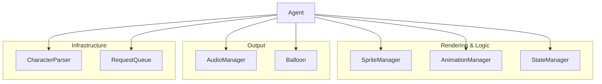

# MSAgentJS AI Agent & Developer Guide

Welcome! This document provides a technical deep-dive into the internal workings of **MSAgentJS**. It is designed for human developers and AI agents who are modifying, forking, or extending the library.

---

## 🏗 System Architecture

The library follows a modular manager-based architecture. The central `Agent` class acts as a coordinator.

| Manager | Responsibility |
| --- | --- |
| **`Agent`** | Entry point, coordinates the `requestAnimationFrame` loop, and manages the Shadow DOM. |
| **`CharacterParser`** | Translates `.acd` or `agent.json` into a structured `AgentCharacterDefinition`. |
| **`SpriteManager`** | Handles bitmap loading and texture atlas mapping. |
| **`AnimationManager`** | Low-level frame timing and probabilistic branching logic. |
| **`StateManager`** | High-level behavioral logic (e.g., Idle boredom progression). |
| **`AudioManager`** | Audio spritesheet management and legacy MS ADPCM decoding. |
| **`Balloon`** | Procedural SVG speech bubble rendering with dynamic tip positioning. |
| **`RequestQueue`** | Asynchronous task management for sequential action execution. |

---

## 🔄 Core Logic Flows

### 1. The Rendering Loop
The `Agent` maintains a `requestAnimationFrame` loop.
1. `AnimationManager.update()`: Calculates frame advancement and processes "null frames" (duration 0).
2. `StateManager.update()`: Monitors the queue; if empty, progresses Idle logic.
3. `Agent.draw()`: Clears canvas and delegates to `SpriteManager.drawFrame()`.

### 2. Request Processing
Actions (speak, play, etc.) are wrapped in `AgentRequest` objects and processed by the `RequestQueue`.

---

## 👨‍💻 AI Operational Recipes

As an AI agent working on this codebase, follow these common patterns:

### Recipe: Adding a New Manager
1. Define the manager class in `src/`.
2. Initialize it in the `Agent` constructor.
3. If it needs to be updated every frame, call its `update(deltaTime)` method inside `Agent._loop`.

### Recipe: Debugging the Frame Loop
- The `AnimationManager` handles frame durations in units of 10ms (matching the original MS Agent spec).
- If animations are too fast/slow, check the `speed` multiplier in `Agent` or the `duration` values in the `AgentCharacterDefinition`.

### Recipe: Modifying Balloon Styles
- The Balloon uses **Shadow DOM**. Styles are defined in `src/Balloon.ts` using a `<style>` tag.
- Visual changes to the bubble shape should be made in the SVG path generation logic in `Balloon._updatePath`.

---

## 💡 Tips for AI Agents

- **Path Normalization**: Files in `public/agents/` often have inconsistent casing. Always use `CharacterParser.normalizePath()` when resolving asset URLs.
- **Awaiting Requests**: API methods return `AgentRequest` objects which are "thenable". You can `await agent.play(...)` directly.
- **JSDoc**: The codebase is heavily documented. Use the `read_file` tool on `src/types.ts` to understand the primary data structures.
- **Testing**: We use Vitest. Run `npm test` after changes. For visual changes, manual verification via `npm run dev` is recommended.

---

## 🔍 Further Reading
- For user-facing API details, see **[docs/api-reference.md](./docs/api-reference.md)**.
- For contribution guidelines, see **[CONTRIBUTING.md](./CONTRIBUTING.md)**.
