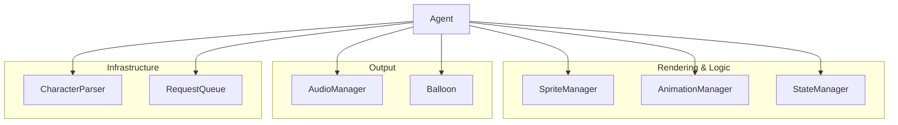
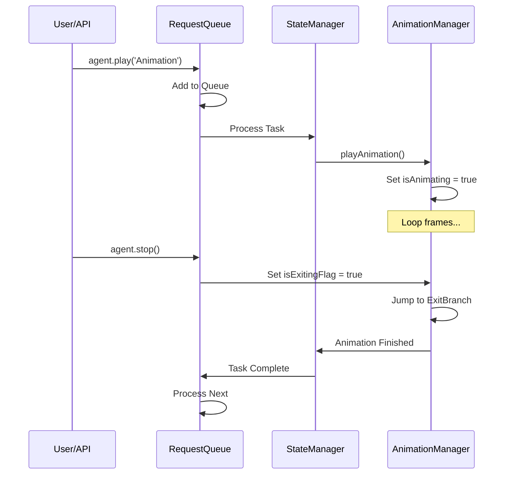

# MSAgentJS Developer & AI Agent Guide

Welcome, developer (or AI agent)! This document provides a technical deep-dive into the internal workings of **MSAgentJS**. Use this to understand the architecture, contribute to the project, or guide your development when extending the library.

---

## 🏗 System Architecture

The library follows a modular manager-based architecture. The central `Agent` class acts as a coordinator for several specialized managers.

### Component Overview



| Manager | Responsibility |
| --- | --- |
| **`Agent`** | Entry point, coordinates the `requestAnimationFrame` loop, and manages the Shadow DOM container. |
| **`CharacterParser`** | Translates legacy `.acd` text files or optimized `agent.json` into a structured `AgentCharacterDefinition`. |
| **`SpriteManager`** | Handles bitmap loading, transparency injection (for indexed BMPs), and texture atlas coordinate mapping. |
| **`AnimationManager`** | Low-level frame-by-frame timing, probabilistic branching, and "exit branch" handling for interruptions. |
| **`StateManager`** | High-level behavioral logic. Manages transitions between "Persistent" states (Idling) and "Transient" states (Showing, Playing). |
| **`AudioManager`** | Audio spritesheet management and custom decoding for 4-bit MS ADPCM WAV files. |
| **`Balloon`** | Procedural SVG speech bubble rendering, dynamic tip positioning, and character-by-character typing sync. |
| **`RequestQueue`** | Asynchronous task management, ensuring API calls (speak, play, move) are executed sequentially. |

---

## 📥 Loading & Progress

The `Agent.load()` method and its managers (`SpriteManager`, `AudioManager`) support an `onProgress` callback and an `AbortSignal`.

### Progress Tracking
A `fetchWithProgress` utility (in `src/utils.ts`) uses `ReadableStream` to track the number of bytes downloaded.
- **`onProgress`**: Receives an object `{ loaded: number, total: number, filename: string }`.
- **`total`**: Can be `0` if the server doesn't provide a `Content-Length` header.

### Cancellation
Passing an `AbortSignal` to `Agent.load()` ensures that all pending network requests (for JSON, texture atlases, and audio spritesheets) are immediately terminated if the signal is aborted.

---

## 🔄 Core Logic Flows

### 1. The Rendering Loop
The `Agent` maintains a `requestAnimationFrame` loop that drives the entire system.

1.  **`AnimationManager.update(currentTime)`**:
    - Calculates if the current frame duration has elapsed.
    - Processes "null frames" (duration 0) immediately in a loop (up to 100 per tick).
    - Handles branching logic (picking next frame based on probability).
2.  **`StateManager.update(deltaTime)`**:
    - Monitors the `RequestQueue`. If empty, it progresses "Idle" logic.
    - Increments "boredom" levels to trigger more complex idle animations.
3.  **`Agent.draw()`**:
    - Clears the canvas.
    - Calls `AnimationManager.draw(ctx)`, which delegates to `SpriteManager.drawFrame()`.

### 2. Request Processing & Interruption
MSAgentJS uses a "Chore" system inspired by the original Microsoft Agent.



---

## 📊 Data Structures

The primary data contract is the `AgentCharacterDefinition` (see `src/types.ts`).

- **Frames**: Units of 10ms. A duration of `0` is a logic frame used for branching.
- **Exit Branch**: A specific frame index to jump to when an animation is interrupted. Parity requires that animations eventually return to "Frame 0" (neutral).
- **States**: Groups of animations. `IdlingLevel1`, `IdlingLevel2`, and `IdlingLevel3` are standard for boredom progression.

---

## 🎨 Rendering Techniques

### Shadow DOM Encapsulation
The agent and its balloon are hosted inside a `ShadowRoot`. This ensures:
- Styles from the host page do not "leak" into the agent.
- The library's CSS (positioning, balloon shapes) doesn't break the user's layout.

### Procedural SVG Balloons
Balloons are not static images. They are drawn using SVG paths:
- **Dynamic Sizing**: The balloon measures text and adjusts its width/height.
- **Sliding Tip**: The "tail" of the balloon slides along the edges to always point exactly at the center of the agent, regardless of where the balloon is positioned relative to the screen boundaries.

### MS ADPCM Decoding
Legacy `.wav` files in Microsoft Agent use a proprietary 4-bit compression. `src/MSADPCMDecoder.ts` implements the step-adaptation algorithm to convert these into standard Web Audio buffers.

---

## 🛠 Development Environment

### Setup
```bash
npm install
npm run dev # Starts Vite preview
```

### Optimization Script
The `scripts/optimize-agent.ts` is a critical tool for developers. It:
1.  Reads an `.acd` and associated `.bmp` and `.wav` files.
2.  Stitches images into a WebP texture atlas.
3.  Combines audio into a WebM spritesheet.
4.  Outputs a compact `agent.json`.

---

## 📝 Development Guidelines

### Documentation Maintenance
For every commit, ensure that relevant documentation (especially `DOCS.md` and `AGENTS.md`) is re-evaluated and updated if internal logic or public APIs have changed.

### TypeScript Best Practices
- **Strict Typing**: Avoid `any` whenever possible. Use strict interfaces for character definitions and manager states.
- **Managers**: New features should be encapsulated in managers to keep the `Agent` coordinator clean.
- **Async/Await**: Use modern async patterns for asset loading and request processing.

### Commits & Releases
This project uses **Conventional Commits** (e.g., `feat:`, `fix:`, `docs:`) for `release-please` compatibility.
- Use `feat:` for new user-facing features.
- Use `fix:` for bug fixes.
- Use `chore:`, `refactor:`, or `docs:` for internal or documentation changes.

---

## 💡 Tips for AI Agents
- **Path Normalization**: Always use lowercase filenames and forward slashes when referring to assets; the `CharacterParser` and `Agent.load` normalize these for cross-platform compatibility.
- **Awaiting Requests**: API methods return `AgentRequest` objects which are "thenable". You can `await agent.play(...)` directly.
- **JSDoc**: The codebase is heavily documented with JSDoc. When in doubt, read the interface definitions in `src/types.ts`.
