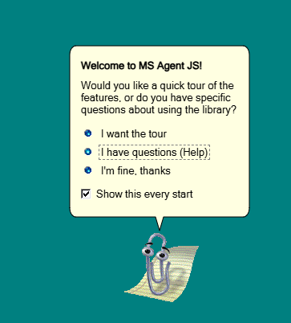

<p align="center">
  
</p>

<h1 align="center">MSAgentJS: The Modern Clippy for the Web</h1>

<p align="center">
  <a href="https://www.npmjs.com/package/ms-agent-js">
    
  </a>
  <a href="https://github.com/azayrahmad/ms-agent-js/actions/workflows/deploy-pages.yml">
    
  </a>
  <a href="https://www.npmjs.com/package/ms-agent-js">
    
  </a>
  <a href="./LICENSE">
    
  </a>
  <a href="https://www.typescriptlang.org/">
    
  </a>
</p>

A web reimplementation of Microsoft Agent. Bring back Clippy and other classic Office assistants with authentic animations and speech support. Perfect for retro UIs and nostalgic web projects.



Inspired by [clippy.js](https://github.com/clippyjs/clippy.js), this is a fully rewritten project focuses on a more faithful and modern recreation of Microsoft Agent with improved animation handling, richer features, extensibility, and a design that works seamlessly on any web page.

<p align="center">
  <a href="https://azayrahmad.github.io/ms-agent-js/"><strong>Live Demo</strong></a> |
  <a href="./docs/getting-started.md"><strong>Documentation</strong></a> |
  <a href="./CONTRIBUTING.md"><strong>Contributing</strong></a>
</p>

## ✨ Features

- **Zero Dependencies**: No jQuery or any other external libraries required to run.
- **Modern API**: Simple, promise-based API for animations, state transitions, and speech.
- **Zero CSS leakage**: Shadow DOM isolates the Agent, making it safe to drop into any project.
- **High Performance**: Uses HTML5 Canvas and optimized asset formats (WebP/WebM).
- **Speech Support**: Support text input, selection list, and action buttons. TTS support with browser's native Web Speech API.
- **Draggable**: Built-in support for repositioning agents via mouse/touch or programmatically. 
- **Legacy Support**: Works with decompiled MS Agent's ACF files directly. Add your own Agents!

## 🎭 Available Agents

Current iteration of MSAgentJS focuses on recreating early Microsoft Agent 2.0 featured in Office 2000. Support for later versions such as Genie and Merlin is in the works.
| Clippit | The Dot | F1 | The Genius | Office Logo | Mother Nature | Monkey King | Links | Rocky |
| :---: | :---: | :---: | :---: | :---: | :---: | :---: | :---: | :---: |
|  |  |  |  |  |  |  |  |  |

## 📦 Installation

```bash
npm install ms-agent-js
```

You can also download the pre-built library and assets directly from [GitHub Releases](https://github.com/azayrahmad/ms-agent-js/releases).

## 🛠 Quick Start

```javascript
import { Agent } from 'ms-agent-js';

async function init() {
  const agent = await Agent.load('Clippit');
  await agent.show();
  await agent.speak('Hello! I am your web assistant.');
}

init();
```

---

## 📖 Documentation Map

- **[Getting Started](./docs/getting-started.md)**: Installation and basic usage.
- **[API Reference](./docs/api-reference.md)**: Full list of methods, options, and events.
- **[Request System](./docs/request-system.md)**: Understanding the asynchronous action queue.
- **[Asset Management](./docs/assets.md)**: How to add and optimize new agents.
- **[Demo Implementation](./docs/demo-guide.md)**: A guide to how the demo is built.
- **[Contributing](./CONTRIBUTING.md)**: Guidelines for developers and repo setup.
- **[Internal Architecture](./docs/internals.md)**: Deep dive into the engine's core logic.
- **[AI Onboarding](./AGENTS.md)**: Specific recipes and tips for AI agents.

## 🤝 Credits

- The original [Microsoft Agent](https://learn.microsoft.com/en-us/windows/win32/lwef/microsoft-agent) for Microsoft Office 2000 by Microsoft Corporation.
- Reimplementations and decompilers, including [Double Agent](https://doubleagent.sourceforge.net/), [MSAgent Decompiler by Remy Lebeau](http://www.lebeausoftware.org/software/decompile.aspx), and more recently [TripleAgent](https://github.com/calavera42/TripleAgent) by [calavera](https://github.com/calavera42).
- The first JavaScript implementation who started it all, [clippy.js](https://github.com/clippyjs/clippy.js) by [smore](https://github.com/smore-inc), and some great forks like [ClippyJS_EasyAccess](https://github.com/djbritt/ClippyJS_EasyAccess) by [Daniel Britt](https://github.com/djbritt) and [Clippy](https://github.com/pi0/clippy) by [Pooya Parsa](https://github.com/pi0).
- The demo page is styled using [98.css](https://jdan.github.io/98.css/) by [Jordan Scales](https://jordanscales.com/).
- [TMAFE](https://tmafe.com/), the Microsoft Agent community that provides many Agent files and information.

## ⚖️ License

[MIT License](./LICENSE).
