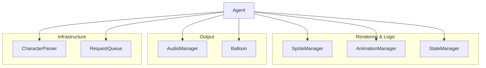
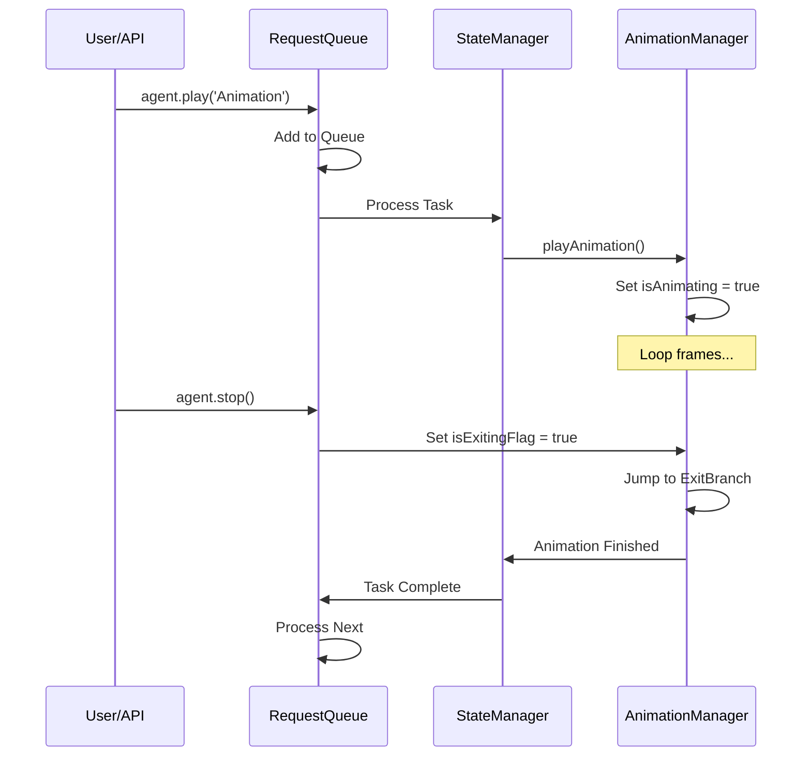

# Internal Architecture

This document provides a technical deep-dive into the internal workings of **MSAgentJS**. It is intended for developers who want to understand the engine's core logic or extend its capabilities.

---

## 🏗 System Architecture

The library follows a modular manager-based architecture. The central `Agent` class acts as a coordinator for several specialized managers.

| Manager | Responsibility |
| --- | --- |
| **`Agent`** | Entry point, coordinates the `requestAnimationFrame` loop, and manages the Shadow DOM container. |
| **`CharacterParser`** | Translates legacy `.acd` text files or optimized `agent.json` into a structured `AgentCharacterDefinition`. |
| **`SpriteManager`** | Handles bitmap loading, transparency injection (for indexed BMPs), and texture atlas coordinate mapping. |
| **`AnimationManager`** | Low-level frame-by-frame timing, probabilistic branching, and "exit branch" handling for interruptions. |
| **`StateManager`** | High-level behavioral logic. Manages transitions between "Persistent" states (Idling) and "Transient" states (Showing, Playing). |
| **`AudioManager`** | Audio spritesheet management and custom decoding for 4-bit MS ADPCM WAV files. |
| **`Balloon`** | Procedural SVG speech bubble rendering, dynamic tip positioning, and character-by-character typing sync. |
| **`RequestQueue`** | Asynchronous task management, ensuring API calls (speak, play, move) are executed sequentially. |

---

## 🔄 Core Logic Flows

### 1. The Rendering Loop
The `Agent` maintains a `requestAnimationFrame` loop that drives the entire system.

1.  **`AnimationManager.update(currentTime)`**:
    - Calculates if the current frame duration has elapsed.
    - Processes "null frames" (duration 0) immediately in a loop.
2.  **`StateManager.update(deltaTime)`**:
    - Monitors the `RequestQueue`. If empty, it progresses "Idle" logic.
    - Increments "boredom" levels to trigger more complex idle animations.
3.  **`Agent.draw()`**:
    - Clears the canvas.
    - Calls `AnimationManager.draw(ctx)`, which delegates to `SpriteManager.drawFrame()`.

### 2. Request Processing & Interruption
MSAgentJS uses a "Chore" system inspired by the original Microsoft Agent.

