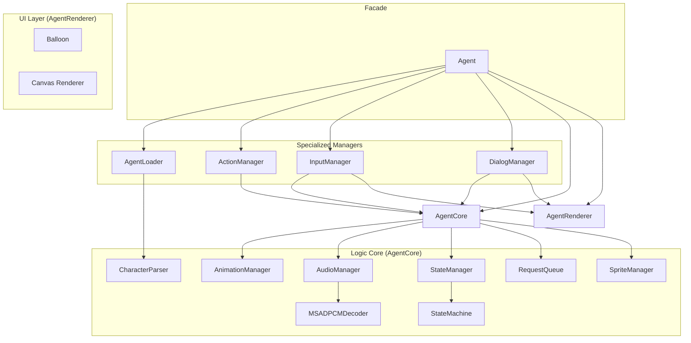
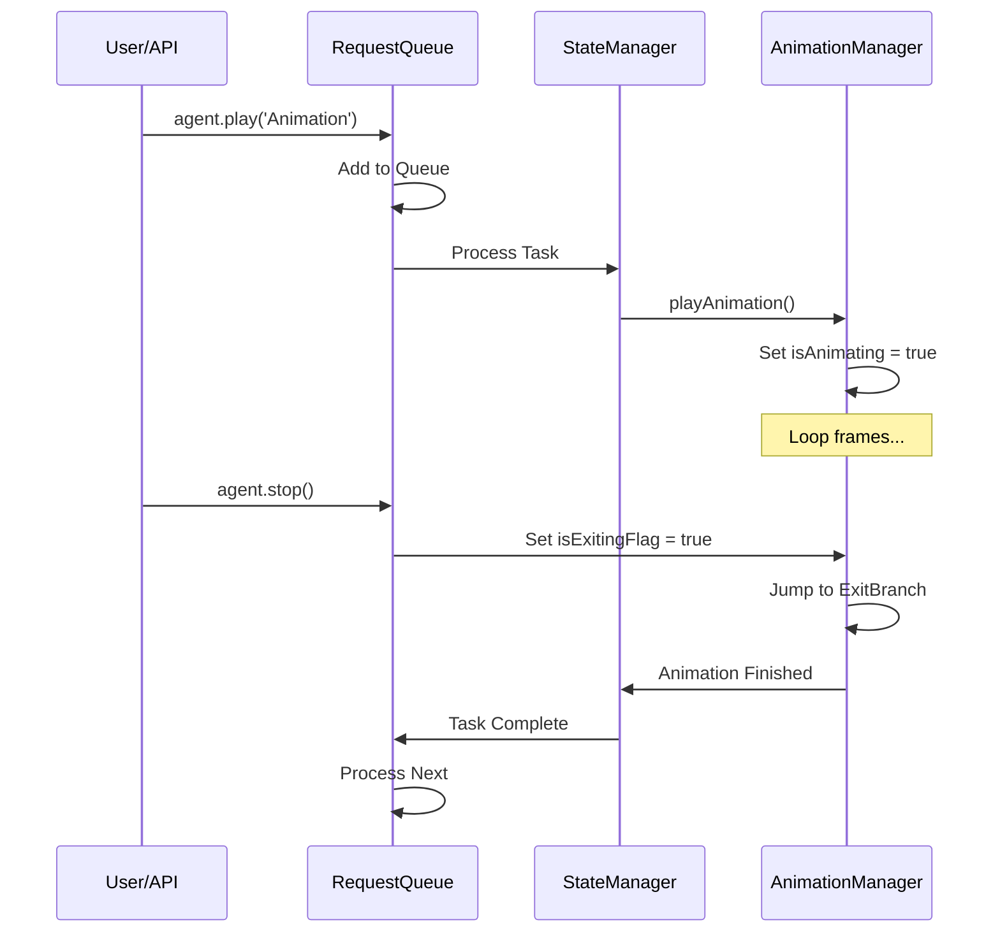

# Internal Architecture

This document provides a technical deep-dive into the internal workings of **MSAgentJS**. It is intended for developers who want to understand the engine's core logic or extend its capabilities.

This project is a clean-room reimplementation based on [official Microsoft Agent documentation](https://learn.microsoft.com/en-us/windows/win32/lwef/microsoft-agent), practical observation from real usage, and references to existing open-source implementations like [ClippyJS](https://github.com/clippyjs/clippy.js) and [TripleAgent](https://github.com/calavera42/TripleAgent). Rather than reverse engineering the original binaries, it reconstructs the system’s behavior with a modern architecture for the web. Therefore, some deviations in design and behavior are expected.

---

## 🏗 System Architecture

The library follows a modular manager-based architecture, split between a headless logic core (`AgentCore`) and a browser-based rendering layer (`AgentRenderer`).

| Component | Responsibility | Folder |
| --- | --- | --- |
| **`Agent`** | Public API facade. Coordinates managers, core and renderer. | `src/` |
| **`AgentLoader`** | Handles character definition loading and normalization. | `src/core/resources/` |
| **`ActionManager`** | Coordinates high-level actions (`moveTo`, `lookAt`, etc). | `src/core/behavior/` |
| **`InputManager`** | Manages drag-and-drop and viewport positioning. | `src/ui/` |
| **`DialogManager`** | Handles complex interactive speech balloon dialogs (`ask`). | `src/ui/` |
| **`AgentCore`** | Headless engine. Manages state, animations, and sound logic. | `src/core/` |
| **`AgentRenderer`** | UI layer. Manages Shadow DOM, Canvas, and CSS. | `src/ui/` |
| **`EventEmitter`** | Foundation for event-driven decoupled communication. | `src/core/base/` |
| **`CharacterParser`** | Translates assets into `AgentCharacterDefinition`. | `src/core/resources/` |
| **`SpriteManager`** | Handles bitmap loading and rendering logic. | `src/core/resources/` |
| **`AnimationManager`** | Low-level frame-by-frame timing and branching. | `src/core/behavior/` |
| **`StateManager`** | High-level behavioral state transitions. | `src/core/behavior/` |
| **`StateMachine`** | Lightweight XState-inspired engine for behavioral logic. | `src/core/behavior/` |
| **`AudioManager`** | Audio spritesheet and decoding management. | `src/core/resources/` |
| **`MSADPCMDecoder`** | Decodes legacy Microsoft ADPCM WAV files into PCM. | `src/core/resources/` |
| **`Balloon`** | Procedural SVG speech bubble rendering. | `src/ui/` |
| **`RequestQueue`** | Asynchronous character action queuing. | `src/core/behavior/` |

---

## 🔄 Core Logic Flows

### 1. The Rendering Loop
The `Agent` maintains a `requestAnimationFrame` loop that drives the entire system.

1.  **`AnimationManager.update(currentTime)`**:
    - Calculates if the current frame duration has elapsed.
    - Processes "null frames" (duration 0) immediately in a loop.
2.  **`StateManager.update(deltaTime)`**:
    - Sends a `TICK` event to the internal behavioral state machine.
    - Detects when an animation has finished and sends an `ANIMATION_END` event.
    - Manages "boredom" levels through the machine's context to trigger more complex idle animations.
3.  **`AgentRenderer.draw()`**:
    - Clears the canvas.
    - Calls `AnimationManager.draw(ctx)`, which delegates to `SpriteManager.drawFrame()`.

### 2. Behavioral State Machine
The `StateManager` uses a declarative state machine to manage the agent's high-level transitions.

- **States**: `Hidden`, `Showing`, `Hiding`, `Playing`, `Persistent` (for Idles and custom states).
- **Events**: `TICK`, `ANIMATION_END`, `SHOW`, `HIDE`, `PLAY`, `STATE_SET`.
- **Guards**: `hasRequests`, `isNotAnimating`, `shouldLoopPersistent`.
- **Actions**: `playShowAnimation`, `updateStateAnimation`, `resetIdle`, etc.

This structured approach makes it easy to add new behavioral modes or customize the agent's reaction to user interaction without modifying the core rendering loop.

### 3. Request Processing & Interruption
MSAgentJS uses a "Chore" system inspired by the original Microsoft Agent.

